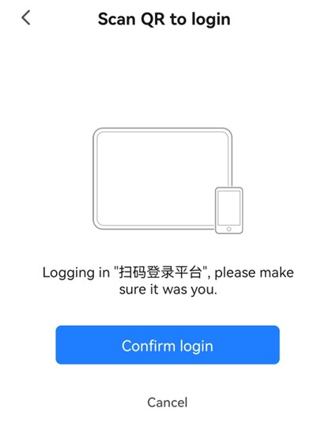

## Guide to setup Atorch S1 Socket
1. Plug the device into a power socket and turn it on. Once the device is turned on, you should see this screen (This happens if the device is new or not configured to an available WiFi network around you).

2. From the main page, press and hold M to enter the menu page
3. Then, press M repeatedly until you reach 12: Wifi Device Reset

4. Press and hold M to reset

5. Once done, you can start setting up the Smart Life app.

## Smart Life App (Tuya Devices)
1. Download the Smart Life app by Volcano Technology from the app store on your device (smartphone/tablet)

2. Once downloaded, open the app and click on sign up if you're a new user. Else, proceed to log in.

3. Now, you can plug in your Tuya device and turn it on. (If the device is an Atorch S1 socket, please refer to the guide to set up the socket)

4. Then, you can start adding your Tuya devices by clicking on the '+' button on the top right and then, clicking on 'Add Device'.

5. Make sure to turn on Bluetooth so that the app can detect the device.
6. Once detected, you can click on the 'Add' button.

7. Then, enter the Wi-Fi information accordingly and click on 'Next'. The app will initially set the Wi-Fi that your smartphone/tablet is currently on.
  - If you're unable to add the device to the app, please check that Bluetooth is on and that you're connected to a 2.4 GHz Wifi network (based on the device's network compatibility).

8. Wait for the device to be added. Once successfully, click on the pen icon to change the name of the device.
  - Note that the device name should follow these conditions (according to the Node-RED flow for Tuya API - Refer to the Tuya API section)
    - if the device is monitoring the grow light - 'Light' should be in the name (eg: Rack 1 Light)
    - if the device is monitoring the water pump - 'Water' should be in the name (eg: Rack 1 Water)

9. After renaming the device, click on 'Done', and now the device is successfully added.

10. Now, you will need to link this app to your Tuya Cloud project in the Tuya IoT Platform.

For more documentation on this, refer to https://developer.tuya.com/en/docs/iot/user-manual-for-tuya-smart-v3177?id=K9obrofrfk4sk

## Tuya IoT Platform Setup
1. For new users, sign up for the Tuya IoT Platform via https://auth.tuya.com/register
2. Then, proceed to login to the platform via https://auth.tuya.com/
3. Once logged in, you will be on the main page. Now, to link your Smart Life app, you will need to create a new Tuya Cloud project. So, click on the 'Cloud' option on the left hand and click on 'Development'.

4. Then, click on 'Create Cloud Project' and fill up the necessary details in the form before clicking on 'Create' button.
    - Please make sure that for the 'Data center' field, Central Europe Data Center is selected, and for the 'Development Method' field, Custom is selected.

5. Next, select the required API services as shown on the Selected API Service side and click 'Authorize'

6. Then, the project is created successfully

7. Now, link your Smart Life app to the project by clicking on 'Open Project' and then clicking on 'Devices'

8. Next, click on 'Link Tuya App Account' and then, click on 'Add App Account'

9. A QR code should pop up. 

10. Scan that QR code using the Smart Life App. So, open the app and click on the '+' button on the top right, and then, click on 'Scan'.

11. Click on 'Confirm Login'.

12. Set the device permissions.

13. Now, the Smart Life app and all the devices registered in the app are connected to the project.

Do note that the project is a trial edition and lasts for a month. You may either ask for an extension or upgrade the project to a paid edition. The request for an extension generally takes about 1 - 2 days and it can be rejected.

Refer to this for the pricing - https://developer.tuya.com/en/docs/iot/membership-service?id=K9m8k45jwvg9j 

As for the extension, you may follow these steps:

## Tuya Node-RED Flow
Make sure that these node modules are installed inside the Node-RED editor. 

**Node Modules:** 
1. node-red-contrib-crypto-js-dynamic (https://flows.nodered.org/node/node-red-contrib-crypto-js-dynamic)
2. node-red-contrib-influxdb (https://flows.nodered.org/node/node-red-contrib-influxdb) 

**In Node-RED Editor**
1. Click on the '≡' button in the top right-hand corner.
2. Then, click on manage palette.
3. If node modules are not listed under the 'Nodes' tab, go to the 'Install' tab and install these modules.

Refer to the ``Tuya Node-RED Flow Documentation.pdf`` & ``Tuya Flow.json`` for a more detailed explanation of the flow.
